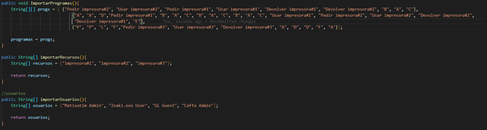

# OBLIGATORIO SISTEMAS OPERATIVOS

---------------------------------
---------------------------------
#### Docente: Angel Caffa
#### Grupo: M4D
#### Alumnos:
- #### Matías Gonzalez (219329)
- #### Gastón Landeira (238473)
- #### Iñaki Etchegaray (241072)

## TECNOLOGIA:

Nosotros para realizar la simulacion, utilizamos el lenguaje de programacion JAVA en su última version (buscarversion). Codificamos en VSCode y mantuvimos un versionado por un repositorio en GitHub.

## ACERCAMIENTO AL PROBLEMA

Para afrontar este problema planteamos la implementación que le dariamos a cada componente del sistema:

*Sistema/Simulador:*
Esta es la clase donde se guardan todo lo vital para la simulacion del SO. Se guardan los procesos, los recursos, el grafo para detección de deadlocks, los usuarios, los programas, y es donde se simula también el reparto de memoria.

*Memoria:*
Para la memoria utilizamos multiprogramación con particiones fijas. Dedicamos una partición por cada programa guardado en el codigo, esto significa que cada una de ellas posee todos los procesos resultantes de la ejecucion del programa asociado a la misma.

*Procesador:*
El procesador está conformado por un scheduller el cual se maneja por una cola PEPS y la conversión de ciclos que representan un quantum del sistema. Cada instrucción se ejecuta en una cantidad de ciclos, cuando la suma de ellos llega a 1 quantum, se le quita el procesador por timeout a un proceso y se llama al siguiente en el scheduller.
La función principal que tiene el procesador(hablando de su codigo) es la de ejecutar el proximo proceso.

*Procesos y recursos:*
El sistema posee procesos y recursos estaticos. Para generar la interacción entre ellos, decidimos marcar 3 palabras clave a modo de funciones. Si una instruccion comienza con "Pedir " "Usar " o "Devolver " el sistema detecta eso y procesa la interacción con el recurso. Para especificar con que recurso ocurre esta acción luego de la palabra clave se escribe el nombre del mismo. Un ejemplo de esto seria, si quiero pedir la impresora#1, la instrucción seria "Pedir impresora#1" En caso de no tener ninguna de las palabras clave se lo toma como una instrucción asincronica.

*Programas:*
Los programas los interpretamos como si fuesen arrays de Strings, siendo cada una de estas una instrucción. Los programas son fijos desde la inicialización del sistema y los procesos recurren a ellos en un inicialización.

*Instrucciones:*
Utilizamos una clase instrucciones, la cual abstrae cada linea del lenguaje, pero que a su vez la asocia con la cantidad de ciclos que consume ejecutarla. Este tiempo de ejecución lo damos de forma randomica a una instrucción, ese valor luego se mantiene durante toda la ejecución del proceso. Si a la instrucción "A" del proceso 1 se le da una duración de 2 ciclos, todas las instrucciones "A" dentro de ese programa demoraran 2 ciclos en ejecutarse.

*Usuarios:*
Para los usuarios definimos 3 templates: Admin, User, Guest. Los admin tienen acceso a todos los procesos y recursos del sistema. Los User y Guest van a ser definidos manualmente para cada caso de prueba. Se intenta mantener una consistencia entre la cantidad de permisos que tiene un User y un Guest (El Guest teniendo siempre menos permisos que el User).

*Detección de Deadlocks:*
Llegando a las ultimas iteraciones decidimos implementar un sistema de deteccion de deadlocks. Para ello decidimos usar el metodo que nos parecia mas exhaustivo en la detección de los mismos. Para ello implementamos un grafo similar al visto en clase.

*Funcionamiento del grafo:*
El grafo está compuesto por nodos, los cual tienen una id y un bool que define si es un proceso o un recurso.
Cuando se pide un recurso se genera una arista dirigida del Proceso al Recurso.
Cuando se le da permiso al proceso para acceder a un recurso, y por ello se asigna ese proceso al recurso, se borra la arista de P -> R y se agrega la arista R -> P.
Esto permite que detectar un ciclo en el grafo equivalga a detectar un deadlock en el sistema y gracias a esto podemos solucionarlo antes de que ocurra.

*Solución a los Deadlock:*
Si bien en un sistema operativo real esto no seria correcto de implementar. Para mantener la continuidad del sistema, matamos el proceso que genera el deadlock, aplicando un procesamiento muy similar al aplicado cuando no se tiene permiso para utilizar un recurso. Se devuelven los recursos asignados a ese proceso y se lo da por terminado, liberando su lugar de memoria y quitandolo del scheduller.

*Interfaz:*
Si bien no tenemos una interfaz propiamente dicha, tenemos un pequeño menu principal en la consola el cual permite navegar entre los distintos casos de prueba que tenemos predefinidos.

Para realizar la simulación, nosotros tuvimos un acercamiento iterativo. Es decir, creabamos distintas versiones de la solución y la ibamos mejorando por iteración.

### PRIMERA ITERACIÓN

En la primera iteración, definimos la base del Simulador. Creamos las clases básicas, como por ejemplo: Sistema, Procesador, PCB, RCB(base nomás), Instrucción y main.

Quisimos simular la dinámica de schedulling y round robin del procesador con procesos estáticos, sin recursos y un solo usuario, respetando los timeouts de los procesos. 

Para ello, definimos el quantum del procesador, insertamos las instrucciones y le asignamos una cántidad de ciclos determinada pero aleatoria, el loop principal, el guardado de los procesos en sistema, sus estados (Listo y En Ejecución) y el log en consola de los mismos.

#### PRUEBAS:

En la imágen a continuación se ve parte de lo loggeado. A efectos de simplificar el README, pusimos solo partes de las ejecuciones. Para acceder a los resultados completos, ver el anexo.md.

Como una primera iteración del programa, nos sastiface mucho y cumple los objetivos que nos pusimos.

### SEGUNDA ITERACIÓN

En la segunda iteración, decidimos empezar a desarrollar el manejo de Recursos Serialmente Reusables. Para ello, nos ideamos un primer recurso ejemplo y trabajamos desde ahi, pero siempre pensando en la multiplicidad de recursos.

Definimos el RCB, el estado de Bloqueado de un Proceso y sus distintas interacciones con el código ya hecho. Para controlar estas interacciones, definimos los primeros tres comandos de nuestro lenguaje: Pedir, Usar y Devolver.

Además, decidimos agregar un código de colores al log, ya que se estaba tornando muy largo, tedioso e intentendible. A continuación se encuentra una leyenda de los colores definidos:

- Verde: Manejo de Procesos y Schedulling.
- Cyan: Cambio de estado de los Procesos.
- Blanco: Ejecucion de instrucciones.
- Blanco Fuerte (Bold): Manejo de Recursos.
- Amarillo: Advertencias de procesos no finalizados y recursos aun utilizados.
- Rojo: Errores que no deberían de ocurrir.

Una véz comprobado su funcionalidad con un RSR solo, decidimos agregar casos de prueba con varios RSR. Aún no fueron implementados manejos de Deadlocks.

#### PRUEBAS:

Los datos de prueba para esta iteración fueron estaticos. A continuación se muestran:

Y la imágen siguiente muestra parte de los resultados de la prueba. De nuevo, la prueba entera se encuentra en anexo.md en este mismo repositorio.

De nuevo, analizando el caso y los resultados, son todos favorables. Incluso un caso borde que aparece funciona como debería. El mismo es que un Proceso entre en timeout luego de pedir un recurso, el resultado esperado es que se acceda al recurso y quede bloqueado, pero no realizando su función ya que no se le dio el comando de ser utilizado. Sucede lo esperado.

### TERCERA ITERACIÓN

Para esta iteración decidimos añadir manejo de permisos con usuarios. Para ello, agregamos varios usuarios estáticos con roles pre-definidos (Guest, User y Admin) los cuáles poseen distintos permisos sobre distintos programas. Guest tiene permisos limitados mientras que Admin posee todos los permisos.

Los usuarios poseen permisos sobre Programas y sobre Recursos. Si se solicita la corrida de un Proceso que ejecuta un Programa que el usuario no posee permiso, ese Proceso se mata. Además, si tuviera permisos sobre un Programa que solicita un recurso al cuál el usuario no tiene permiso, al llegar a la línea de pedido se mata el Proceso.

Además, cabe mencionar que arreglamos un error conceptual que teníamos. El mismo era que cuando un Proceso pedía un Recurso, si el mismo no se encontraba disponible que pasára a Bloqueado, nosotros lo habiamos hecho que pasára a Listo. Esto fue arreglado.

Además agregamos el color violeta a nuestro código de colores que representa el manejo de permisos.

#### PRUEBAS:

Los datos de prueba para esta iteración fueron estáticos nuevamente. A continuación se muestran:

Cabe destacar que el Admin tiene permiso para todos los programas, mientras que el User tiene permiso para dos y el Guest sólo a un programa. Además, tal como lo muestra la imágen anterior, los procesos 0 y 4 fueron corridos por un Usuario Admin, no debería de haber problema con el Usuario 'Matixatim'. Sin embargo, los procesos 1, 2 y 3 son corridos por un Usuario Guest, 'GL' debería de poder correr el proceso 2, pero no el 1 y 3, ya que no tiene permisos. Los resultados se muestran a continuación:

Las pruebas corren de manera esperada, el Usuario 'Matixatim' corre todos los procesos sin problema. Sin embargo, el Usuario 'GL' no puede correr el proceso 1 y 3, pero si el proceso 2, tal como se esperaba. Nuevamente, una versión completa de las pruebas se encuentra en el Anexo.

### CUARTA ITERACIÓN

Antes de adentrarnos a la próxima iteración, vale destacar que decidimos probar nuestro sistema contra un deadlock. El deadlock era muy simple:

- Proceso 0: 
     - Pide Impresora 1.
     - Corre otras cosas hasta un timeout.
     - Pide Impresora 2.
- Proceso 1: 
     - Pide Impresora 2.
     - Corre otras cosas hasta un timeout.
     - Pide Impresora 1.

Ejecutamos estos dos procesos y nos dio un deadlock como aparece en la imagen siguiente:

Esto no termina, como es de esperar de un deadlock:

Sin embargo, en esta iteración no quisimos adentrarnos aún en los deadlocks. En vez, quisimos antes lidiar con el tema de la memoria.

Para el manejo de memoria, decidimos simular un sistema de Multiprogramación con Particiones Fijas. Como nuestra cantidad de programas es fija, decidimos hacer una partición por programa. Cada una de ellas posee todos los procesos resultantes de la ejecución del programa asociado a la partición. Cada una de estas particiones poseen arrays representando el espacio en memoria asignado. Su largo es estático e igual entre todas las particiones.

El funcionamiento implementado es el siguiente:
- Un trabajo es iniciado en ejecución como un proceso nuevo.
- El proceso va a la partición asociada en memoria.
- Si hay lugar en memoria para el Proceso:
     - Se agrega a ese lugar y al Round Robin del Procesador.
- De lo contrario
     - Se agrega a una cola localizada en la Partición.

- Si un proceso es removido en memoria por fin de ejecución (sea por falta de permisos o si realmente termino de hacer su trabajo) se toma un proceso nuevo de la cola y se asigna a la memoria.

Nosotros nos aseguramos de logear esto, así es notable en la simulación. Para ello, agregamos el naranja, asociado al manejo de memoria, a nuestro lenguaje de colores.

#### PRUEBAS:

Los datos de prueba de esta iteración siguen siendo estáticos:

Notar que hay tres procesos corriendo el programa cero, nuestras particiones tienen tamaño estático en memoria de 2 en esta iteración. Por lo tanto, para que la prueba funcione bien, deben de aparecer mensajes que indiquen el guardado del proceso 2 en la lista de espera. Otra cosa a señalar es que sabemos que los programas 0 y 1 estan seteados para que suceda un deadlock, pero el programa 1 no corre ya que todos los procesos asociados a él son corridos por un usuario que no tiene permiso para correrlos.

Los resultados de las pruebas son satisfactorios. Tal como debía suceder, el proceso 2 fue alojado en la cola de la partición y no fue añadido a memoria. Más tarde, cuando se va el proceso 0, el proceso 2 se agrega a memoria y al scheduler:

Nuevamente, el caso completo se encuentra en el anexo.

### QUINTA ITERACIÓN

Como mencionamos previamente, nuestro simulador hasta esta iteración acepta y sufre deadlocks. Para ello, decidimos encarar este problema con una de las posibles soluciones vistas en clase: un grafo de asignación de Recursos.

Implementamos una estructura de Grafo con conocimientos de la materia de Algoritmos 2 y un poco de ayuda de internet para acelerar el proceso, luego integramos el funcionamiento de este Grafo al sistema cargando Procesos y Recursos. Representamos los Procesos y Recursos por su id personal junto con un booleano que representaba si era un recurso o un proceso (ya que un proceso puede tener el mismo id que un recurso, por ser clases distintas).

El funcionamiento es el siguiente:
- Cáda vez que un Proceso pide un Recurso, creamos una arista en el grafo desde el Proceso hacia el recurso representando el pedido.
- Cáda vez que se vaya a asignar Recurso a un Proceos, antes de asignarlo simulamos en el grafo que pasaria si se asigna el recurso al Proceso:
     - Removemos la arista de Proceso a Recurso, simulamos que le es dado.
     - Agregamos la arista de Recurso a Proceso
     - Vemos si posee un ciclo:
          - Si tiene, se mata el proceso, logeamos que se detecto un Deadlock y que se mato un proceso (en color rojo).
          - Si no tiene, lo dejamos obtener el Recurso.
- Cáda vez que un Proceso devuelve un Recurso, se saca la arista de Recurso a Proceso, el cíclo de vida del Proceso en el grafo ha acabado.

El deadlock se produce cuando se encuentra un cíclo en el grafo de asignaciones. El cíclo significa deadlock porque representa como un Proceso 1 esta esperando por un Recurso 1 siendo utilizado por Proceso 2 que esta esperando por un Recurso 2 siendo utilizado por Proceso 1, esto núnca terminará ya que ambos están bloqueados, el sistema al encontrar estos ciclos, predice correctamente lo que va a suceder y lo évita.

También vale la pena destacar que el grafo es inicializado con todos los procesos y recursos a disposición del Sistema Operativo. Entendémos que en un Sistema Operativo Genérico real, la operación de buscado de cíclo sería muy costosa, pero para nuestro simulador nos pareció la mejor alternativa a tomar.

#### PRUEBAS:

Los casos de prueba fueron los mismos para la iteración anterior, pero esta vez el deadlock corre y está seteado:

Nos sucedió que nuestro sistema funcionaba correctamente algunas veces y otras veces no. 

PRIMER CASO:

SEGUNDO CASO:

Nosotros creemos que esto se debía a la randomización de las duraciones de ciclos por procesos, a veces daba un caso "lindo" y otras un caso "feo". Pero esto también significaba que habían casos que todavia no funcionaba correctamente, tuvimos que revisar el código y ver que nos faltaba.

Encontramos que habia una sucesión de casos o instrucciones específicas que al agregarse al grafo no agregaba una relación de Recurso a Proceso, por ende avanzando sin checkear la existencia de cíclos en ese paso. Si la cantidad de cíclos randómicos corridos por la instrucción generaban timeout previo a la ejecución de estas instrucciones todo funcionaba correcto (primer caso). En cambio, si no se generaba un timeout, sucedia lo explicado previamente (segundo caso). Arreglando este caso, la detección quedo funcionando correctamente.

Nuevamente, valga la redundancia, el caso completo se encuentra en el archivo anexo.md.
### SEXTA Y ULTIMA ITERACIÓN

Para esta última iteración, nos centramos en el uso del Simulador y la generación de algunos casos de pruebas. Para ello, creamos una interfaz por consola simple, pero que hace su trabajo bien. Además, cambiamos las instrucciones a un lenguaje natural envez de abstracto.

Con un simple while y un Scanner generamos la siguiente interfaz de Usuario:

Su uso es el esperado, inserta el número e irá a otros menúes. El menú uno lleva a los casos de prueba que creamos, el dos a una breve explicación de cada caso de prueba y el ultimo simplemente termina la ejecución.

El menú uno simplemente muestra opciones sobre distintos casos de prueba, los mismos serán explicados a continuación:

Elegír una de las opciones corre el caso de prueba y luego vuelve al menú de pruebas para iniciar otra simulación.

#### PRUEBAS:

Generamos siete distintos casos de prueba:

El primer caso involucra programas que generan el deadlock básico que vimos en la iteración 4.

// Fotos relevantes al primer caso

El segundo y tercer caso involucra programas que genera deadlocks más controvertidos, en los cuáles más recursos están involucrados y la ejecución es más mezclada.

// Fotos relevantes al seg y ter caso

El cuarto es una prueba sobre permisos de Usuarios, en el mísmo generamos varios Usuarios con distintos permisos sobre distintos Procesos y Recursos

// Fotos relevantes al cuarto caso

El quinto es una prueba sobre el sistema de particiones en memoria. Generamos muchos procesos con programas cortos y esperamos que alamacene todos y deje algunos en espera.

// Fotos relevantes al quinto caso

El sexto es otra prueba de memoria, pero un poco más extrema. Creamos 11 procesos de un mismo programa, esto debería de degenerar la ejecución a una lista de espera en la partición.

// Fotos relevantes al sexto caso

La séptima y última prueba es más general é involucra varios de estos elementos al mismo tiempo.

// Fotos relevantes al ultimo caso

### GUÍA DE COLORES FINAL:
- Verde: Manejo de Procesos y Schedulling.
- Cyan: Cambio de estado de los Procesos.
- Blanco: Ejecucion de instrucciones.
- Blanco Fuerte (Bold): Manejo de Recursos.
- Amarillo: Advertencias de procesos no finalizados y recursos aun utilizados.
- Rojo: Errores que no deberían de ocurrir y deadlocks.
- Violeta: Manejo de Permisos de Usuarios.
- Naranja: Manejo de memoria.

### CONCLUSIONES
El desarrollo de este simulador nos ayudó a fortalecer los conceptos vistos en clase. No fue tanto la programación lo interesante de este proyecto, sino las discusiones que provocó entre integrantes del grupo y como fuimos capaces de llevar a la aplicación estos conceptos. En conclusión, el grupo se lleva los conocimientos adquiridos y satisfacción por haber logrado crearlo.
